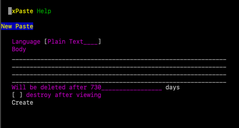

# Ansible course training application deployment

### Software requirements

The deployment has been tested with the following software:

- host machine:
```
$ lsb_release -a
No LSB modules are available.
Distributor ID:	Debian
Description:	Debian GNU/Linux 10 (buster)
Release:	10
Codename:	buster
```
- Virtualbox:
```
$ sudo aptitude show virtualbox
No candidate version found for virtualbox
Package: virtualbox
State: not a real package
Provided by: virtualbox-7.0 (7.0.6-155176~Debian~buster)
```
- Vagrant:
```
$ sudo aptitude show vagrant
Package: vagrant                         
Version: 2.3.4
State: installed
Automatically installed: no
Priority: optional
Section: default
Maintainer: HashiCorp <support@hashicorp.com>
Architecture: amd64
Uncompressed Size: 258 M
Description: Vagrant is a tool for building and distributing development environments.
```
Vagrant owners block access to their repositories from some countries, so you may need to use some workarounds to get vagrant and its boxes.

### Steps to run deployment

Power on VMs:
```
cd ansible-practicum
vagrant up
```

Verify VMs are running:
```
$ vagrant status
Current machine states:

controlnode               running (virtualbox)
server_centos             running (virtualbox)

This environment represents multiple VMs. The VMs are all listed
above with their current state. For more information about a specific
VM, run `vagrant status NAME`.
```

Go to the controlnode VM and run the playbook. Please provide gitlab.slurm.io username and password to clone training application source to your virtual machine.
```
vagrant ssh controlnode
cd ansible
ansible-playbook playbook.yaml --extra-vars "git_user=s123456 git_pass=TRUMP123KFC"
```

At the end playbook show you a URL where you can access web application:
```
TASK [Print app url] **********************************************************************************************************************************************************************************************************************************************\
*
ok: [server_centos] => {
    "changed": false,
    "msg": "Application xpaste available at: http://192.168.57.3"
}
```

You can access and verify training application on your host machine console browser:
```
apt intall -y lynx
lynx http://192.168.57.3
```
Press ```a``` to accept cookies, and you should get something	like this:


To quit	the lynx browser press ```q``` twice.

If you want to clean up the	installation run from your host	machine inside ansible-practicum directory:

```
vagrant	destroy -f
```

That's it, enjoy!

